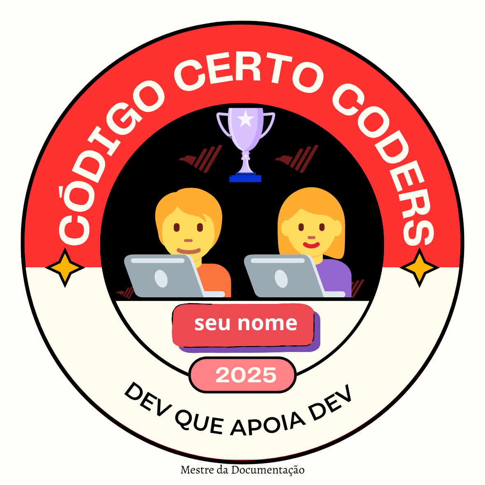

# 🤝 Badge Dev que Apoia Dev

## 📛 Identificação do Membro
- **Usuário GitHub:** robsonamendonca
- **Nome:** Robson Mendonça
- **Pessoa Indicada:** ralmtrigglabs
- **Projeto da Pessoa Indicada:** https://github.com/ralmtriggolabs/generate-readme
- **Entrega:** 2025-11-21

---

## 🎯 Critérios Atendidos
- [x] Indicação válida para o desafio Mestre da Documentação.
- [x] A pessoa indicada concluiu o desafio corretamente.
- [x] Identificação confirmada.
- [x] Colaboração ativa na comunidade.

---

## 🖼️ Badge Recebido

---

## 🎖️ Reconhecimento
O membro **robsonamendonca** está oficialmente certificado como **Dev que Apoia Dev** pela comunidade **Código Certo Coders**.

---
✨ _Código Certo Coders – Crescemos ajudando uns aos outros._
